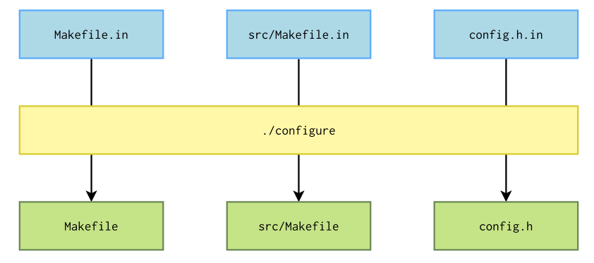
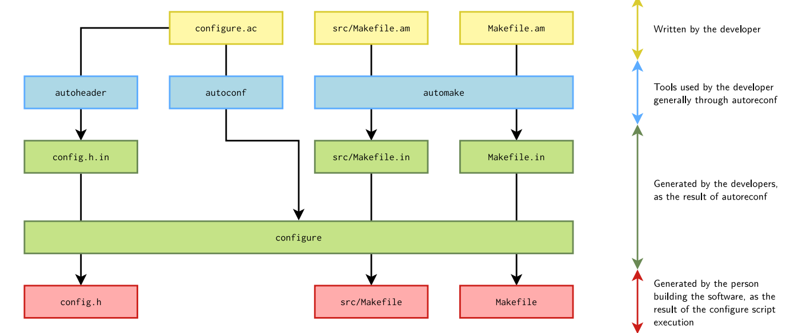

# autotools

## usage

1. Configuration

```
$./configure
```

2. Compilation

```
$make
```

3. Installation

```
$ make install
```

## what configure does




## Internals



## Dependent tools

## autoconf

### automake

### m4

## reference
1. http://events.linuxfoundation.jp/sites/events/files/slides/petazzoni-autotools-tutorial.pdf
