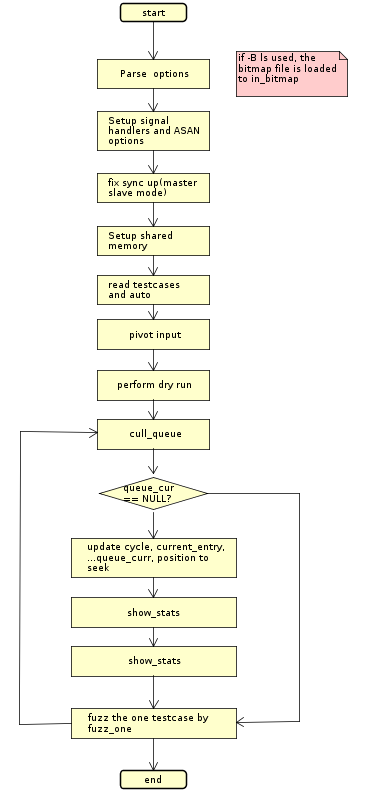
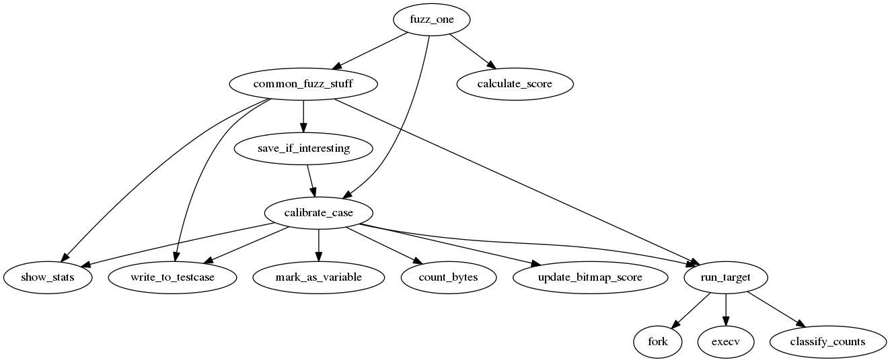

# American fuzzy lop

The flowchart of afl-fuzz

The core part is in `fuzz_one` function.

The call graph of `fuzz_one` is like this:

## bitmap

There is a hidden option `-B` for loading the bitmap.
When this is used, the contents of the specified file
will be read into `virgin_bits`.

`has_new_bits`: it will compare `trace_bits` with the argument
by comparing byte by byte, if there is a byte which has
value other than `0xff` in `trace_bits` while the value in
`argument` is `0xff`, then it means a new edge is found,
this function returns 2, else if there is(are) byte(s)
of different values, it will return 1.

After a new edge is detected, the corresponding byte is marked
by bit-anding the negation of the value `trace_bits`.

How does this work?

## scoring the input

## pending_favored

How does this work?

## implementation details

1. When AFL found no new inputs, it will try using testcase splicing
   by setting `use_splicing` to 1 and and update the number of cycles
   without new inputs.
