# Angr source study

## simvex

This is the package that is able to "execute" or simulate
program in the VEX format.

### concept

#### Mode

It is able to simulate program in symbolically and concretely.
This is called execution mode.

#### Program State

Program state is tracked using `SimState` class, including:
- register values
- memory values
- file system

Other important/interesting features of the program state is provided
via `Plugins`, including:

- regs: accessing registers
- mem: accessing memory
- se: constraint solver engine
- log:
- inspect: breakpoint mananger
- posix: some features defined in posix
- scratch: information about the current state
- libc: information of the c library
- cgc: information about the cgc environment
- unicorn: control of the unicorn engine
- uc_manager:

The class diagram is as follows:

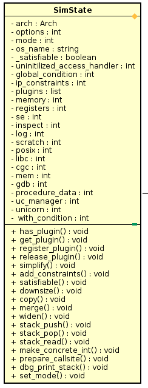


#### Execution Engine

Execution engines are used to `execute`(interpret, simulate)
the code(vex code) that is accociated with the current state(
the `ip` of the current state can be retrieved from the `ip` field
of SimState object, more information can be get from the `Scratch`
state plugin object).

The API that does the execution is `process` defined in SimEngine.
It takes a SimState object(s1) as argument, returns the possible states
after executing the basic block asscociated with s1. The possible states
are wrapped in `SimSuccessors` class.


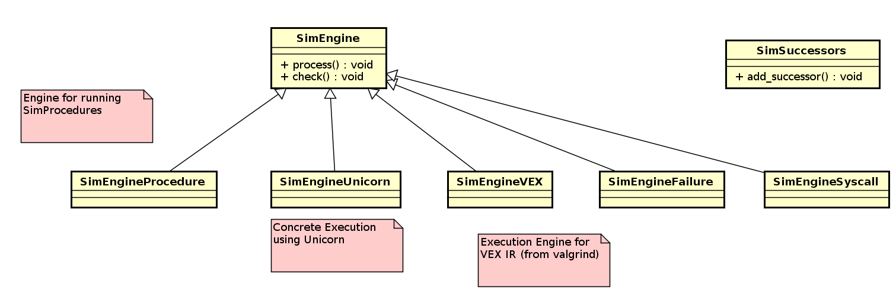

Current implementations are:

- SimEngineVEX: this engine interprets the VEX code one by one.
- SimEngineUnicorn: this engine execute the code with Unicorn.
- ...


Some implementationd details:
1. Some common code is written in the parent class `SimEngine.process`, the different
implementations are in `_process` method, which takes a new state and a SimSuccessors
as argument.
2. In SimEngineVEX, `_process` first lift the binary code basic block to VEX IR
Super block, and invoke `_handle_irsb` to handle the superblock. After doing some
setup for the successors object, it iterates through all the statements in the
superblock and invoke `_handle_statement` to handle each VEX statement.
`_handle_statement` will further call `translate_stmt` which will call the
`process` method of each class representing the simulated IR statement.

> Important note: in the end of `_handle_statement`, it checks the type of the
> statement, if it is an `pyvex.IRStmt.Exit` statement, it means that we need
> to branch and track the constraints:
> https://hexdump.cs.purdue.edu/source/xref/simuvex/simuvex/engines/vex/engine.py#315

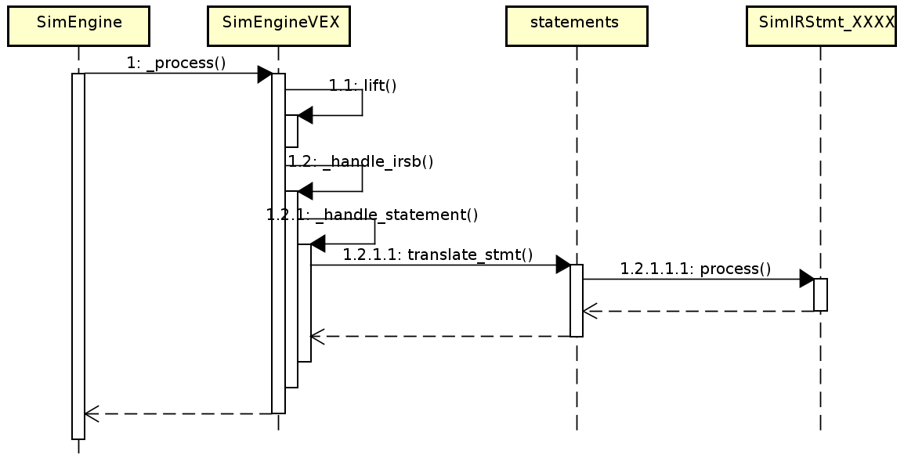


#### SimVexIR

This part is used to execute code represented in VEX IR and track
the constraints in symbolically execution.

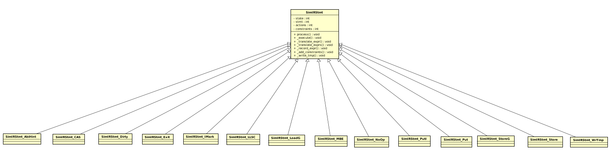

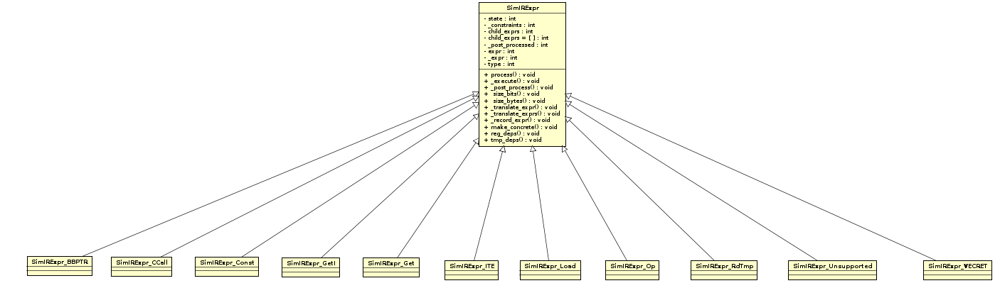

Some implementation details:

1. SimIRStmt defines some common functions for its subclasses to reuse them:
   - \_translate\_expr
   - \_translate\_exprs
   - \_record\_expr
   - \_record\_exprs
   - \_add\_constraints
   - \_write_tmp

It exports `process` method to handle a VEX IR statement. The following is its
sequence diagram. `process` calls the `_execute` function of its subclasses which
takes an valina VEX IR expression and SimState as argument and construct a
corresponding SimIRExpr object(it is fully processed before being returned).


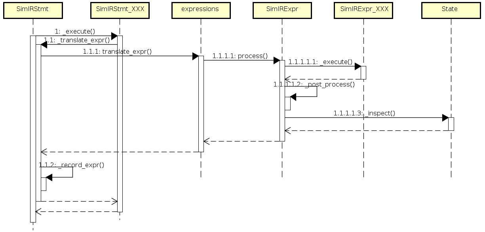

#### Plugins

Plugins are used to access information from a program state.
The system maintains all plugin implmentations in a `default_plugins`(defined
in plugins/plugin.py). All plugin implementation classes have a static method
that will register itself in `default_plugins`.

All plugins are subclasses of `SimStatePlugin`.

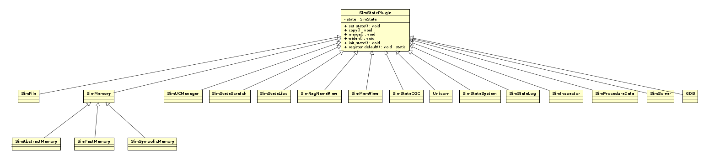

Each plugin provides unique APIs to get information
associated with the plugin.

A SimState object has a field for for handling different aspects
of a program.

| FieldName  | Plugin Class           | Desc                   |
|------------|------------------------|------------------------|
| memory     |SimSymbolicMemory       | Symbolic memory        |
| mem        |SimMemView              | |
| register   |SimSymbolicMemory       | |
| regs       |SimRegNameView          | |
| libc       |SimStateLibc            | |
| posix      |SimStateSystem          | |
| solver\_engine(se) | SimSolver       | |
| cgc        | SimStateCGC            | |
| scratch    | SimStateScratch        | |
| log        | SimStateLog            | |
| procedure\_data| SimProcedureData    | |
| gdb        | GDB                    | |
| inspector  | SimInspector           | |
| unicorn    | Unicorn                | |
|uc\_manager  | SimUCManager           | |


##### SimSymbolicMemory and related

Important API:
- store: used to save a **value** to an **address** of some **size**;
- load: used to load a **value** from an **address** of some **size**;

Some of the internal API implementations:
1. `SimMemory.set_state`: asssociate the SimState object with it by
   calling `SimStatePlugin.set_state` and initialize `_stack_region_map` and
   and `_generic_region_map` passed from the constructor.
2. `SimMemory._resolve_location_name`: get the location of registers, not complete?
3. `SimMemory._convert_to_ast`: convert `data_e` to an claripy ast expression, if it
   is a string or integer, create a bitvector for it, if it is a SimIRExpr, call its `to_bv`
   member function.
4. `SimMemory.set_stack_address_mapping`:
5. `SimMemory.unset_stack_address_mapping`:
6. `SimMemory.stack_id`: Return a memory region ID for a function. If the
   default region ID exists in the region mapping, an integer will be appended
   to the region name, this is to handle recursive function calls.
7. `SimMemory._constrain_underconstrained_index`: If the possible address
   (represented by passed in argument) range is beyond the predefined limit,
   add some constraints to the state.
   ([here](https://hexdump.cs.purdue.edu/source/xref/simuvex/simuvex/storage/memory.py#799)).
8. `SimMemory.store`: store a **value** to an **address** of some **size** and a **condition**,
   **value**, **address**, and **size** can be symbolic:
   - convert value, address, size and condition to symbolic expressions
   - call inpect
   - check the condition, if it does not hold under the state constraintsm, simply return
   - call `_constrain_underconstrained_index` to restrict the address
   - create a `MemoryStoreREquest` object and call `_store` method implementation in subclasses.
   - call inspect
   - handle actions

9. `SimMemory.store_cases`: save value to a memory location with condition. it accept
   an address and a list of contents and a list of corresponding values to save to
   that address. In case the condition does not hold, we can provide a fallback value
   to write to that address, by default, the fallback value is the original value.
   - convert address, contents, codnitions and fallback to claripy ast
   - load the original value to be fallback if no fallback value is provided
   - call `_store_cases` to do the job
   - ....

10. `SimMemory._store_cases`:
   - extend the size of each content to the max size
   - merge the conditions of the same contents and make a new constraint for the
     conditions by connecting all of them using `or` operator.
   - If there is only one content, same as `store` dose, create MemoryStoreRequest
     object and call `_store`; if there are multiple contents, first simplify them;
     create a ite operation, create a MemoryStoreRequest for it and call `_store`.

11. `SimMemory.load`: load contents from an address of size.
    - convert address, size, condition and fallback to a claripy ast.
    - call inspect
    - call `_constrain_underconstrained_index` to restrict the address
    - call `_load` and post handling
    - call inspect

12. `SimMemory.find`: returns the addresses of bytes equal to some value.
13. `SimMemory.copy_contents`:


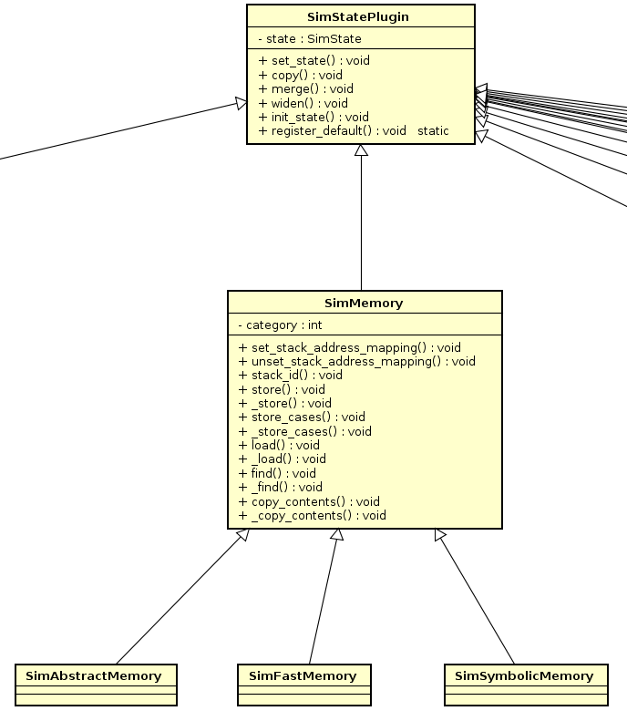


SimSymbolicMemory
----

A subclass of SimMemory with symbolic support. It uses `SimPagedMemory` for symbolic
tracking support.

Make an address symbolic:
1. loads the original expression from the memory.
2. create unconstrained bytes for the value
3. call `store` of `SimMemory` to save the unconstrained
   value to the address, which in turn calls
   [\_store](https://hexdump.cs.purdue.edu/source/xref/simuvex/simuvex/plugins/symbolic_memory.py#648)
   of SimSymbolicMemory.
4. Add a constraint to the state.

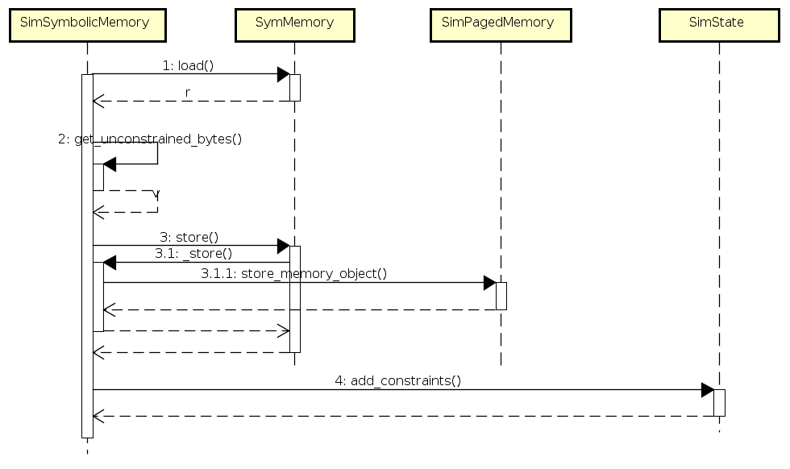

Related classes
----

SimMemoryObject:this class is used to emulate an object in the memory.
Object is internally represented using a claripy Expression object.
This class also includes some other utility functions:
- includes: taking an address as argument, returns true if it is within
  the object, else return false
- bytes_at: takes an address and length as argument, returns the object
  within the range overlapping with the object.


Page and SimPagedMemory:

Page represents a page analogous to the page in OS. SimPagedMemory
is used to manage the manage all the pages in an address space, including
map/unmap, load/store memory objects, manage symbolic memory addresses etc.

Classes for representing a page includes a base class named
`BasePage` and 2 subclasses: `TreePage` and `ListPage`.

- contains: first load an object and check whether index is included in the object.
- store_mo: save an object in the page
- copy: make a copy of the page
- keys: returns the list of addresses that are used.
- load_mo: loads a memory object from mthe page
- replace_mo: replace an old object in the page with a new object
- store_overwrite: if the object is bigger than the page, write with sinkhole
  mechanism, else set all the `_storage` array element accordingly.
- store_underwrite:if the object is bigger than the page, write with sinkhole
  mechanism, else set only the `_storage` array elements that are None.
- load_slice: return a list of tuples(addr, object) from start to end.

A memory pages has its permission and can host multiple memory
object. `TreePage` manages the objects in it using a binary tree
while `ListPage` manages its objects using a list.

`ListPage` maintains 2 internal fields `_storage` and `_sinkhole`.
`_storage` is a list of PAGE_SIZE element.
- `_storage` stores memory object like this: of object `A`
  takes `k` bytes from address `a` in this page, all elements
  from `a` to `a+k` point to `A`.

- `_sinkhole` is used when the whole page belongs to an object, in
  which case, we only need to track only one object.

SimPagedMemory is used to manage the paged memory system consisting of
multiple pages and the objects in these pages. By default, it uses the
`ListPage` implementation.

Important fields:
- `_pages`: all the pages
- `_memory_backer` and `_permission_backer`: places where we can get contents
  and permission info from.
- `_permission_map`: it saves the permission maps
- `_cowed`: the pages set to be COW
- `_initialized`: the initialized pages
- `_page_size`: the size of one page in byte, default to be 4K


Important methods:

- `branch`: Create a SimPagedMemory object that is brached from the current info.
- `load_objects`: given an address and the number of byte, return a list of all
  mapped memory objects.
- `_create_page`: create a new ListPage object from the address given as argument.
- `_initialize_page`: fill in the page with appropriate values, possibly from backers
- `_get_page`: return the page specified by the page number provided as argument
- `contains_no_backer`: check whether there are backers for an address
- `keys`: return all the addresses where there are objects saved
- `changed_bytes`: return the set of different bytes between 2 `SimPagedMemory`
- `_apply_object_to_page`: write a memory object to a page
- `_containing_pages`: return the pages containing a start and end address
- `_containing_pages_mo`: return the pages containing a memory object
- `store_memory_object`:
- `replace_memory_object`
- `replace_all`:
- `get_symbolic_addrs`: get all addresses marked as symbolic.
- `addrs_for_name`: Returns addresses that contain expressions that contain some name
- `addrs_for_hash`: Returns addresses that contain expressions that contain a variable with a hash value
- `memory_objects_for_name`: return the memory objects with some name
- `memory_objects_for_hash`: return the memory objects with some hash value
- `permission`: return the permission of an address
- `map_region`: create pages and map them to the address space
- `unmap_region`: unmap pages specified in an region.

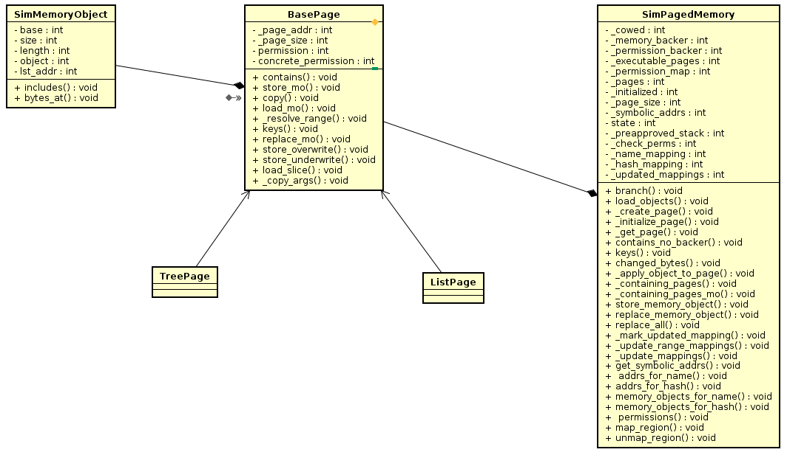


##### SimSolver

It is a wrapper for the functions provided by claripy.

It includes a constraints solver whose implementation
might vary depending on the configuration.

It exports functions to:
1. create variables(symbolic variables)
   - BVS
   - Unconstrained
2. add constraints
   - add
3. check satisfiability
4. extract solutions
5. constraints simplification
   - simplify

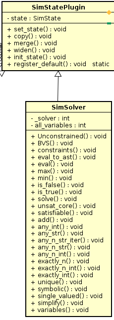


### SimProcedure

Simply put, a SimProcedure is a class that implements a function `run`
and will be called when some conditions hold, when `run` is executed,
the state and successors arguments will be passed so that the procedure
can update the state and returned successors.

There are a lot of subclasses of SimProcedure for different purposes.
It is wide used in the angr project, e.g., the linux loader is emulated
using a `LinuxLoader` which is a subclass of SimProcedure. Hooks are implemented
using SimProcedures and .....

### SimAction

It is used to reprensent some semantic information of the program, e.g., `SimActionData`
represents a data read or write to or from memory, register, or file.
`SimActionConstraint` represents a new constraint is added in the path exploration.
...

## claripy

This is a library for:
1. create symbolic variables
2. build AST and constraints from symbolic variables
3. solve the constraints and get solutions for expressions


## cle

cle is the loader which is able to load binaries into memory.

There are mainly 3 classes:

Loader represents the loader which is able to load any objects.
Backend is used to represent an object.
Clemory is used to represent the momory space.

Loader:
When we construct a Loader object, we pass in a path to a binary
file or a python `file` object to it, or other options, important
options include:
- auto\_load\_libs: whether automatically load the dependent libraries
- force\_load\_libs: a list of libraries to load regardless of if they're required by a loaded object.
- skip_libs: a list of libraries to never load, even if they're required by a loaded object.
- main\_opts: options to control the loading of main object.
- lib\_opts: options to control the loading of dependent libraries

Important fields:
- main\_binary: the `Backend` object loaded from the file system.
- memory: the `Clemory` object.
- shared\_objects: a dictionary name -> backend object
- all\_elf\_objects: a list of backend obejcts(only elf files)
- all\_objects: a list of all backend files
- tls\_object: the tls object

Important method:
- load\_object: load a file from the file system
- add\_object: add the loaded object to the memory map(Clemory object).
- relocate: relocate all the objects, calls `_perform_reloc`

Backend:

Backend is the abstraction of all object files.
It provides various methods to access the information
of the object file. It is loaded to the memory map using
`add_object` method.

Clemory:
The memory map. we can map anything to the memory space
and them access the contents using address.

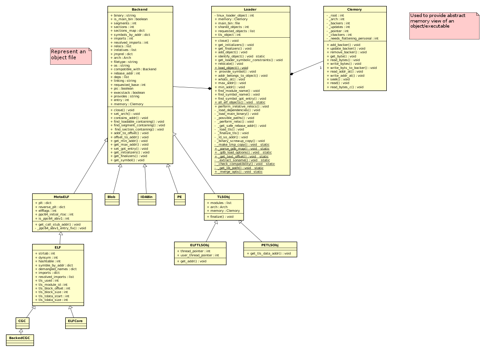


## angr

Project:
--

A project has all the functions of the angr project included in it.

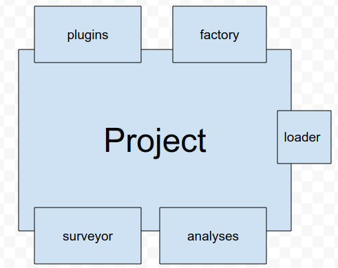

It has 5 categories of function:
1. plugins: including all the mentioned above
2. factory: used to provide some helper functions
3. loader: used to get information about the binary program
4. analyses: used to do analysis on the program
5. surveyors: used to do information collecting

the procedure to create a Project object:
1. Load the program and its dependent libraries using cle.Loader;
2. Determine the CPU architecture of the program to analysze;
3. Setup the default values of some public and private properties, incluidng sim
   procedures, engines, analysis, serveyors and knowledge base;
4. determine the OS of the program to analyse and init SimOS project;
5. register some sim procedures;
6. configure the SimOS object;
7. the plugins are registered by themselves when the python module is loaded;

AngrObjectFactory:
--

this class hosts some functions, in which:

- successors: is used to get the successor from some address
- entry\_state: used to get a state with the entry of the program
- full\_init\_state: used to create a state 
- blank\_state:
- call\_state:
- path:
- path\_group:


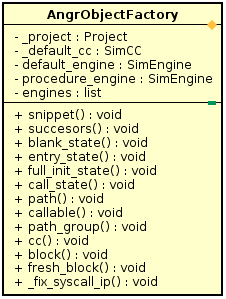


Create a blank state:

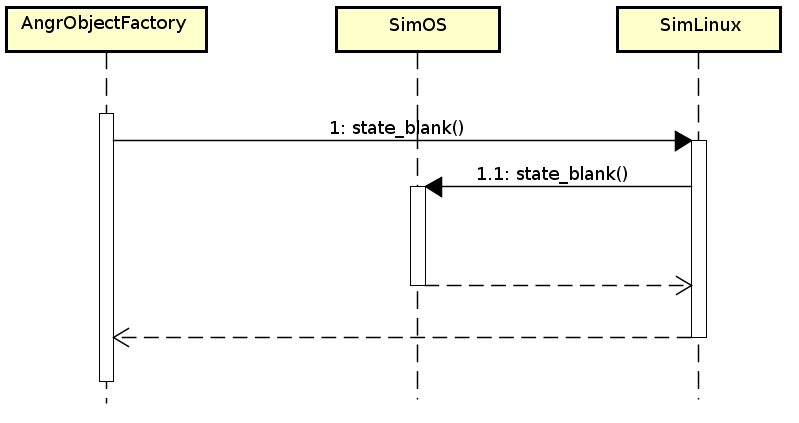

To create a blank state from the factory object, it uses the `SimOS`
object's `state_blank` to achieve that. The general code is in the
parent class `SimOS`, and the OS specific setup is implemented in
subclass `SimLinx`.
In `SimOS.state_blank`:
1. Prepare the arguments for creating `SimState` object:
   - figure oout the analysis mode(symbolic by default);
   - collect the permission map;
   - content backer from the loader object;
   - get arch and os name from the project object
2. Create the `SimState` object
3. setup the stack(set the sp register and initialize the stack with 0 claripy
   expression if necessary[by `o.ABSTRACT_MEMORY`])
4. initialize the registers with 0 claripy expression if `o.INITIALIZE_ZERO_REGISTER`
5. set up the address of instruction(`ins_addr`) and basic block(bbk_addr) and
   scratch plugin.
6. setup the `procedure_data.hook_addr` of the state object

In `SimLinux.state_blank`:

1. if there is a tls object setup the registers accordingly
2. register `SimStateSystem` plugin as `posix`
3. set the ABI in libc for PPC arch

SimOS:
--
It is used to handle OS specific setting,
including the system call table and loader related
setting. It makes extensive usage of SimProcedure
to hook the angr functions into the analysis process.

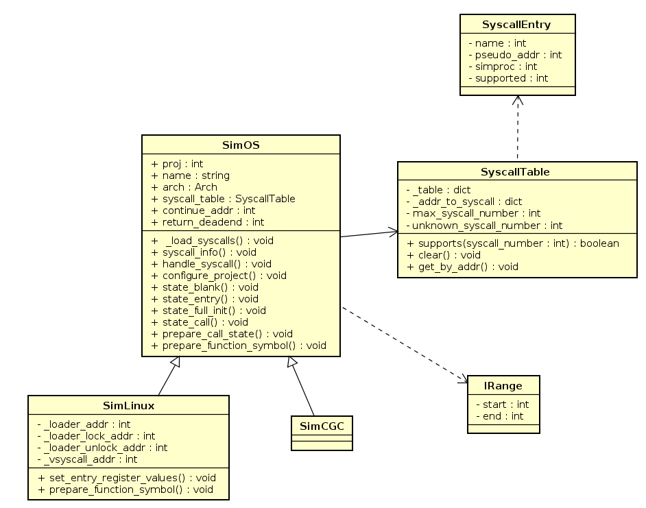

Path and PathGroup
--

Path represents a node in an execution trace.
PathGroup is used to represent multiple paths.

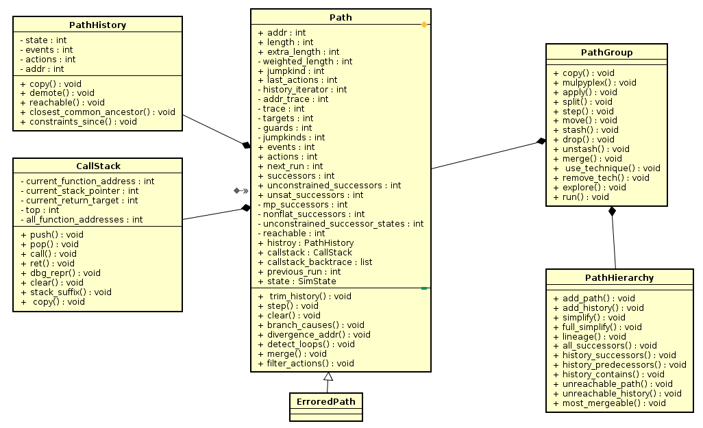


Path:

The connection from one state to another is managed in the `history` field.

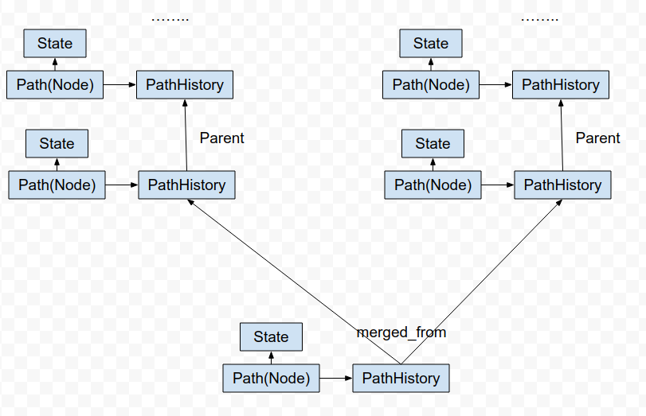

Important fields:
- `state`: the SimState asscociated with the current path node
- `path`: the parent node
- `history`: the PathHistory object
- `callstack`: the CallStack object
- `callstack_backtrace`: the list of call stack
- `_run`: the Successors object returned by the engine executing the current code
  block.
- `previous_run`: the Successors object of its parent node.

- `successors`: all the path nodes that follow the current node in the CFG.
- `unconstrained_successors`: all the unconstraned path nodes that follow the
  current node in the CFG.
- `unsat_successors`: execute the current code block and return all unsat path
   nodes following the CFG of the program

Important methods:
- `_make_successors`: call `factory.successors` and save the returned value in `self._run`
- `_initialize_callstack`: create a `CallFrame` object and push it to the
  `callstack` object and create a `CallStackAction` and append it to
  `callstack_backtrace`.
- `step`: execute the current code block and return all the path nodes following
  the CFG of the program. The execution is done in `_make_successors` which calls
  the `successors` function of the `factory` object and set the possible paths
  in `_run` field.
- `branch_causes`: Returns the variables that have caused this path to branch.
- `divergence_addr`: compare current path with some other path, and return the
  basic block at which the paths diverged.
- `_manage_callstack`: Adds the information from the last run to the current path.

PathHierarchy:

It maintains the graph of the CFG.


PathGroup:
- `move`: move all the paths saved in one group to another group.
- `drop`: remove move all the paths in a group.
- `stash`: move all the paths in a group to a group called `stash`.

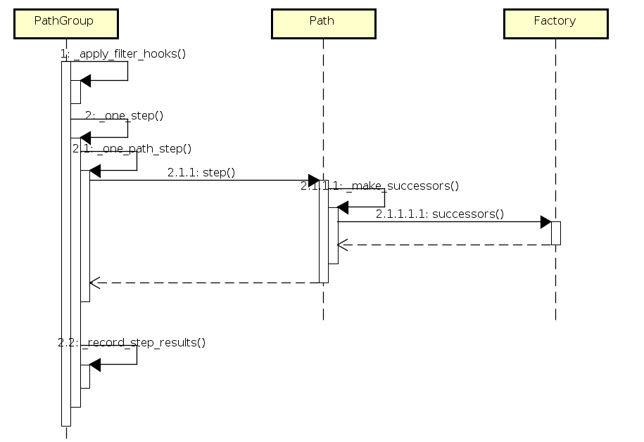

Analysis
--

1. Create and register analysis.

To create a customized analysis class, all we need to do is just create a
subclass of `angr.Analysis`. To register an analysis, using `angr.register_analysis`


    >>> import angr

    >>> class MockAnalysis(angr.Analysis):
    ...     def __init__(self, option):
    ...         self.option = option

    >>> angr.register_analysis(MockAnalysis, 'MockAnalysis')


2. Preincluded analysis:

CFG: there are 2 kinds of CFGs provided by angr. CFGFast
and CFGAccurate.

To get the CFG of a program, first we need to start a `angr.Project`
for that program.
Then use `b.analyses.CFGAccurate` or `b.analyses.Fast` to construct
the CFG.

In genrating the CFGs we can pass some options,


| Option                      | 	Description   |
|-----------------------------|----------------|
| context_sensitivity_level   |	This sets the context sensitivity level of the analysis. See the context sensitivity level section below for more information. This is 1 by default.|
| starts	                  |A list of addresses, to use as entry points into the analysis.
| keep_state	              | To save memory, the state at each basic block is discarded by default. If keep_state is True, the state is saved in the CFGNode.|
| ..... | .....|


Sample code is as following:

```
import angr
b = angr.Project('bin/CROMU_00001', load_options={'auto_load_libs': False})
# generate an accurate CFG
cfg = b.analyses.CFGAccurate(keep_state=True)
```

Visualizing CFGs

Angr does not support for visualization of CFGs.
There is a repo called [angr-utils](https://github.com/axt/angr-utils)
which is undergoing drastic change. There is a function called `plot_cfg`
in it. See the following code sample:


```python
from angrutils import *
plot_cfg(cfg, "CROMU_00001_cfg", asminst=True, remove_imports=True, remove_path_terminator=True)
```

Additional notes:

Using radare2 to get CFG(but this is only the cfg inside a function).
1. disable stripping of the binaries
2. load the binary into r2
3. use `agv` command(this needs `xdot`) or ag to generate a dot file and then
use use dot to generate a png or other files.

Inside r2:
```
ag <addr_of_func> > func_cfg.dot
```

outside of r2:
```
dot -Tpng func_cfg.dot main_cfg.png
```
