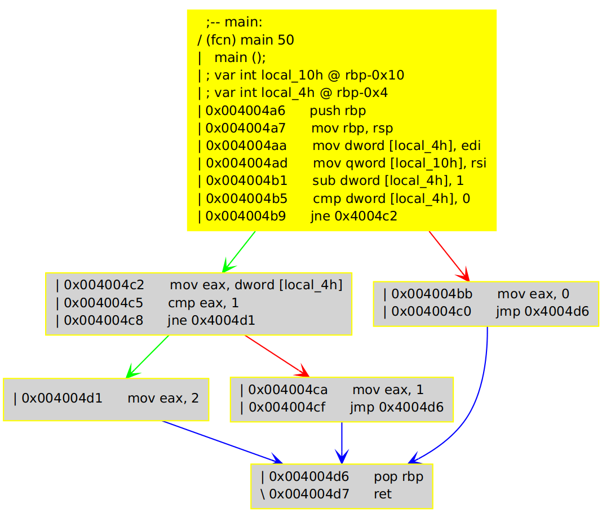

# course for deep understanding angr

## using angr to do symbolic execution

### preparation

Program to use:

Copied from angr-doc.
```C
int main(int argc, char **argv)
{

    argc -= 1;
    if (argc == 0)
            return 0;
    else
    {
            switch (argc)
            {
                    case 1:
                            return 1;
                    default:
                            return 2;
            }
    }
}
```

It is compiled to the binary named 'step0.bin'.

The CFG of the binary:



(this diagram is generated using `agv` cmd in radare2)

Load the binary using angr.Progject as follows:

```python
import angr
p = angr.Project('step0.bin')
```

### Get and prepare a program state

#### Get a program state

The address of main function is `0x4004a6`.
We create an blank state that points to the
start of main using the factory object.

To do so, we use the `factory.blank_state` and pass
the address of main by name `addr`.

```python
init_state = p.factory.blank_state(addr=0x4004a6)
```
`entry_state`,  `full_init_state` and `call_state` can
also be used to create states.

#### Mutate the state

And to setup the execution environment, we need to
initialize some registers. For this example, we initialize
the stack pointer register with the default value of the
architecture.

```python
init_state.regs.rsp = p.arch.initial_sp
```

And from the code we can see that `edi` and `rsi` are used.
`edi` corresponds `argc` in the source code. Here as `argv`
is not used in the code, we only track `argc` as a symbolic
variable. To do so, we assign `edi` register with a claripy
expression.

```python
import claripy
edi = claripy.BVS('edi', 32)
init_state.regs.edi = edi
```

### move the program ahead

Using `p.factory.successors` we can get the successor states.

```python
successors = p.factory.successors(init_state)
print len(successors)  # 2
print successors.successors[0].ip # <BV64 0x4004bb>
print successors.successors[1].ip # <BV64 0x4004c2>
```
We can see that there are 2 successors, one is the block 0x4004bb
and the other is  block 0x4004c2.

we can recursively or iteratively proceed the analysis by applying
successors method to the new states.

### track the constraints

As `successors` method `execute`s the block, it add all the possible
blocks and their constraints to the return value. And we can ask the
solver engine plugin to solve the constraints and extract solutions
for some expressions.

```python
p1 = successors.successors[0]
p2 = successors.successors[1]

print p1.se.constraints

# get a solution for edi
print p1.se.any_int(edi)  # 1
```

### TODO How to merge states
