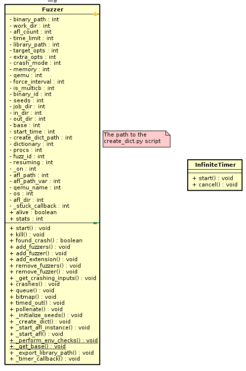

# Driller augmented fuzzing

## Fuzzer Module

### AFL related run env management

| property name | description |
| --------------|-------------|
| binary\_path  | the target program to fuzz |
| work\_dir     | the working directory of the fuzzer |
| in\_dir       | input directory |
| out\_dir      | output directory |
| job\_dir      | job directory    |
| dictionary    | dictionary for fuzzing |
| resume        | whether in resuming mode |
|fuzz\_id       | the id|
| time\_limit   | run time limit |
| target\_opts  | the options for the target program |
| memory        | memory limit for the target program |
| crash\_mode   | if the fuzzer runs in crash mode |
| library\_path | the library paths |
| qemu          | use qemu for instrumentation |
| is\_multicb   | wether run in multi cb mode |
| stats         | get the state file content |

important methods:
- `_perform_env_checks`: check for cpu core pattern and cpu scaling setting
- `start`: start running afl
  - `_start_afl`
  - start timer
  - set `_on` to be true
- `kill`: stop fuzzing afl
- `add_fuzzer`: add one more fuzzing process
- `found_crash`: indicates whether there was some crash found
- `add_extension`:  start a mutation extension process(?)
- `queue`: get all the queue files
- `pollenate`: add all the testcases passed in the argument to the"pollen/queue"
   directory, in this way, the fuzzers are able to read in the testcases and
   influence the fuzzing process.
- `bitmap`: used to extract the bitmap of a fuzzer
- `crashes`: get all the crash inputs
