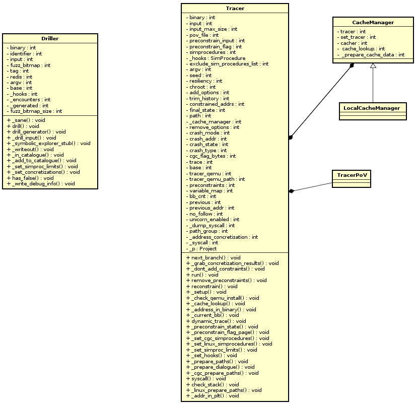

# Driller and Tracer



## Tracer

Tracer is the tool to trace the program concretely.

Important Fields:

| field name  | description |
|-------------|-------------|
|binary       |the path to the program to analys|
|input        |the input to feed in the program |
|argv         | |
|....         | ...|
| os          | the name of the os |
| base        | the base directory of shellphish qemu |
| tracer_qemu | the file name of the qemu |
| tracer_qemu_path | the directory of the qemu |
| crash\_mode | |
| crash\_addr | |
| crash\_state| |
| trace       | the list of addresses of code blocks that were executed |

Important methods:

- `dynamic_trace`: setup the shared memory and  run a binary instrumented with
  AFL compiler with the input. Check if the input triggers crashes or not, if
  it does, collect the addresses where crash happened.

- `next_branch`: move the current path to the next node along the path.

    1. It follows the execution with only one `active` until we reach a group
    with more than 1 active paths or 0 active path.
    2. The paths whose address is not the same as trace[self.bb_cnt] in the
    `active` group is moved to the `missed` group(see [here](https://hexdump.cs.purdue.edu/source/xref/tracer/tracer/tracer.py?a=true&h=_set_cgc_simprocedures#385)).
    3. Save the current path group the the return variable and remove the `missed`
    group.

- `run`: trace the program symbolically along the trace of the input until
  it finds a deadend.


Coding sample:

To start a tracer,
```python
import tracer
input = file('/dev/shm/work/KPRCA_00064/sync/fuzzer-master/queue/id:000007,src:000000,op:ext_UI,pos:0,+cov').read()
t = tracer.Tracer('KPRCA_00064/bin/KPRCA_00064', input=input)
```

In this setting, the tracer will run the program `KPRCA_00064/bin/KPRCA_00064` and
the program will read `stdin` from the input, it is like running the following cmd:

```
$ KPRCA_00064/bin/KPRCA_00064 < /dev/shm/work/KPRCA_00064/sync/fuzzer-master/queue/id:000007,src:000000,op:ext_UI,pos:0,+cov
```

If we want to add more options to the program, we can use
the `add_options` named argument in the constructor.

In the constructor, it will run `dynamic_trace` and colllect the list of basic blocks
exercised during the execution of the target program with the input the addresses
of the basic blocks are saved in the `traces` field. And if the input caused a
crash, it will also save the crash address, crash type and crash state.

```python
import tracer
samplefile  =  "/dev/shm/work/CADET_00003/sync/fuzzer-master/crashes/id:000000,sig:11,src:000000,op:havoc,rep:64"
f = file(samplefile)
input = f.read()
t = tracer.Tracer('CADET_00003/bin/CADET_00003', input=input)

print t.crash_addr
>>> 134513508

print t.trace
    [134514172,
    134514437,
    134514485,
    134514503,
    134514503,
    134514503,
    134514503,
    ....
    134514503,
    134514503,
    134514503,
    134514503,
    134514503,
    134514503,
    ...]
```

In the constructor it will also prepare the `path_group` variable,
which contains a state at address at the first address in the trace.
Preparing the first `path_group` varible is done in `_prepare_paths`
method, which will call others different methods depending on the OS.
There are a lot of detailed setup in those methods, among which the most
important few of them are:
1. create a project
2. setup the project
3. create a path group using `full_init_state`
4. proceed the execution of the state to go to the entry address of the target program

```
import tracer
samplefile  =  "/dev/shm/work/CADET_00003/sync/fuzzer-master/crashes/id:000000,sig:11,src:000000,op:havoc,rep:64"
f = file(samplefile)
input = f.read()
t = tracer.Tracer('CADET_00003/bin/CADET_00003', input=input)

first = t.path_group.active[0]
assert first.addr == self._p.entry
```


The qemu-based tracer this module is based on:

[qemu-cgc](https://github.com/mechaphish/qemu-cgc/) has some
modificcations to run cgc binaries.

1. [this](https://github.com/mechaphish/qemu-cgc/commit/2238b85421fd29f4d5937f7e6251fb89da6346ef)
   is used to execute binaries with cgc magic values.
2. [this](https://github.com/mechaphish/qemu-cgc/commit/de38bff8ce271c477f7b6eee94a29f306aac6352)
modifies the syscall numbers
3. it has some functions for dumping magic contents page

In the initial stage, it uses qemu's trace function to get the
addresses of basic blocks triggered by the input.

For example
```
/home/hexfuzz/.virtualenvs/driller+/local/lib/python2.7/site-packages/shellphish_qemu/bin/shellphish-qemu-cgc-tracer -d exec CADET_00003/bin/CADET_00003 < /dev/shm/work/CADET_00003/sync/fuzzer-master/crashes/id:000000,sig:11,src:000000,op:havoc,rep:64
Reserved 0xf7000000 bytes of guest address space
host mmap_min_addr=0x10000
guest_base  0x7f58e0ded000
start    end      size     prot
08048000-08049000 00001000 r-x
08049000-0805e000 00015000 rw-
4347c000-4347d000 00001000 r--
baa8a000-baaab000 00021000 rwx
IGNORED start_brk   0x00000000
end_code    0x080487e5
start_code  0x08048000
start_data  0x080497e8
end_data    0x0805d9ff
start_stack 0xbaaaaffc
brk         0x0805d9ff
entry       0x080485fc
Trace 0x56348c378350 [080485fc] _start
Trace 0x56348c3783a0 [08048705] _crcx
Trace 0x56348c378420 [08048735] _crcx_docrc
.....
Trace 0x56348c378720 [08048601] _start
Trace 0x56348c378770 [080480a0] main
Trace 0x56348c378860 [08048400] transmit_all
Trace 0x56348c378970 [08048440] transmit_all
Trace 0x56348c3789f0 [08048459] transmit_all
Trace 0x56348c378a30 [0804845e] transmit_all
Trace 0x56348c378ac0 [0804846a] transmit_all
Trace 0x56348c378ba0 [0804861a] transmit

Welcome to Palindrome Finder

Trace 0x56348c378c50 [08048635] transmit
Trace 0x56348c378cd0 [08048490] transmit_all
Trace 0x56348c378d60 [080484ac] transmit_all
Trace 0x56348c378de0 [080484c5] transmit_all
Trace 0x56348c378a30 [0804845e] transmit_all
Trace 0x56348c378e50 [080484d5] transmit_all
Trace 0x56348c378ee0 [080480db] main
Trace 0x56348c378f60 [080480fa] main
Trace 0x56348c378fa0 [080480ff] main
Trace 0x56348c378860 [08048400] transmit_all
Trace 0x56348c378970 [08048440] transmit_all
Trace 0x56348c3789f0 [08048459] transmit_all
Trace 0x56348c378a30 [0804845e] transmit_all
Trace 0x56348c378ac0 [0804846a] transmit_all
Trace 0x56348c378ba0 [0804861a] transmit
	Please enter a possible palindrome: Trace 0x56348c378c50 [08048635] transmit
Trace 0x56348c378cd0 [08048490] transmit_all
Trace 0x56348c378d60 [080484ac] transmit_all
Trace 0x56348c378de0 [080484c5] transmit_all

....

Trace 0x56348c379e30 [08048320] check
Trace 0x56348c379f30 [08048350] check
qemu: uncaught target signal 11 (Segmentation fault) - core dumped [08048364]
```


## Driller

Driller is the tool that augment fuzzing of AFL by symbolic
execution.

Given an input, Driller will generate inputs that will trigger
different paths from the one triggered by the original input.

Driller iteratively calls `next_branch` method of tracer, along the path,
find the constraints of the missed nodes and solve those constraints to
generate inputs that will trigger execution along the missed paths.

`_drill_input` is the method that does the work:

1. it creates a `Tracer` object.
2. it sets concretatization and simproc limits
3. it updates the edges that have been encountered
4. It goes into a loop by running `next_branch` method of tracer object:
   - calculate the index in the AFL bitmap
   - check whether that edge has been covered, if yes, skip the current edge, else
     mark the edge in the bitmap and continue
   - If the edge has been in the encountered set, skip, else, first remove the
     constraints, then if the path condition is satisfiable, solve the constraits
     and extract the input using `_writeout` method.
   - Continue exploring more inputs using symbolic execution along that path
     in `_symbolic_explorer_stub`. It limits the symbolic exploration by `step * number_of_paths < 1024`
