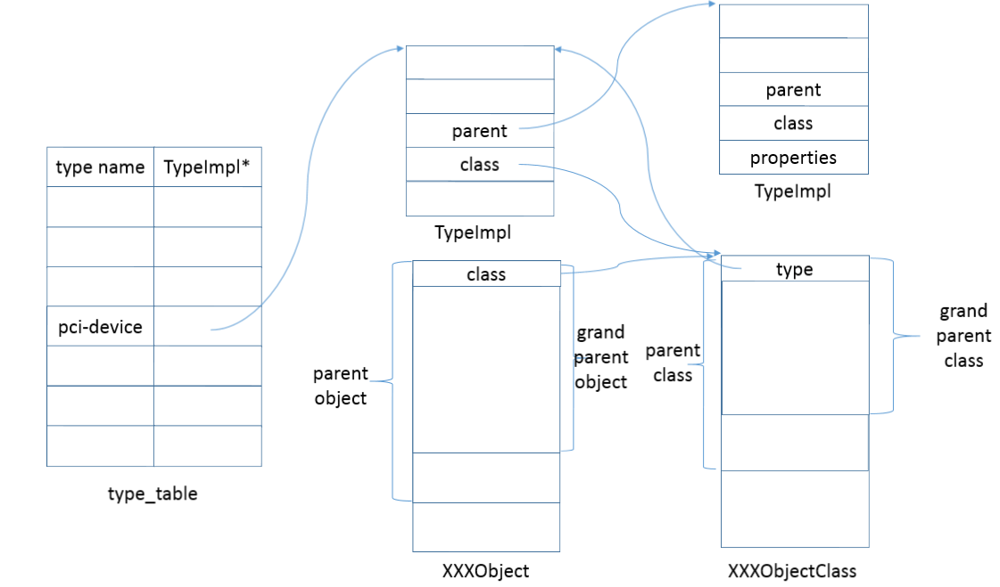

# QEMU学习

标签（空格分隔）： 动态分析

---

#　Qemu代码学习
##  queue.h

文件路径：`include/qemu/queue.h`

这个文件是从NetBSD里面拿来的。
定义了一些函数和宏，用于定义和操作单链表，双向链表，简单队列和尾队列

### list

```C
// 定义一个struct, 名字是name
 #define QLIST_HEAD(name, type)                                          \
struct name {                                                           \
        struct type *lh_first;  /* first element */                     \
}

#define QLIST_HEAD_INITIALIZER(head)                                    \
        { NULL }

#define QLIST_ENTRY(type)                                               \
struct {                                                                \
        struct type *le_next;   /* next element */                      \
        struct type **le_prev;  /* address of previous next element */  \
}

/*
 * List functions.
 */
#define QLIST_INIT(head) do {                                           \
        (head)->lh_first = NULL;                                        \
} while (/*CONSTCOND*/0)

#define QLIST_SWAP(dstlist, srclist, field) do {                        \
        void *tmplist;                                                  \
        tmplist = (srclist)->lh_first;                                  \
        (srclist)->lh_first = (dstlist)->lh_first;                      \
        if ((srclist)->lh_first != NULL) {                              \
            (srclist)->lh_first->field.le_prev = &(srclist)->lh_first;  \
        }                                                               \
        (dstlist)->lh_first = tmplist;                                  \
        if ((dstlist)->lh_first != NULL) {                              \
            (dstlist)->lh_first->field.le_prev = &(dstlist)->lh_first;  \
        }                                                               \
} while (/*CONSTCOND*/0)

#define QLIST_INSERT_AFTER(listelm, elm, field) do {                    \
        if (((elm)->field.le_next = (listelm)->field.le_next) != NULL)  \
                (listelm)->field.le_next->field.le_prev =               \
                    &(elm)->field.le_next;                              \
        (listelm)->field.le_next = (elm);                               \
        (elm)->field.le_prev = &(listelm)->field.le_next;               \
} while (/*CONSTCOND*/0)

#define QLIST_INSERT_BEFORE(listelm, elm, field) do {                   \
        (elm)->field.le_prev = (listelm)->field.le_prev;                \
        (elm)->field.le_next = (listelm);                               \
        *(listelm)->field.le_prev = (elm);                              \
        (listelm)->field.le_prev = &(elm)->field.le_next;               \
} while (/*CONSTCOND*/0)

#define QLIST_INSERT_HEAD(head, elm, field) do {                        \
        if (((elm)->field.le_next = (head)->lh_first) != NULL)          \
                (head)->lh_first->field.le_prev = &(elm)->field.le_next;\
        (head)->lh_first = (elm);                                       \
        (elm)->field.le_prev = &(head)->lh_first;                       \
} while (/*CONSTCOND*/0)

#define QLIST_REMOVE(elm, field) do {                                   \
        if ((elm)->field.le_next != NULL)                               \
                (elm)->field.le_next->field.le_prev =                   \
                    (elm)->field.le_prev;                               \
        *(elm)->field.le_prev = (elm)->field.le_next;                   \
} while (/*CONSTCOND*/0)

#define QLIST_FOREACH(var, head, field)                                 \
        for ((var) = ((head)->lh_first);                                \
                (var);                                                  \
                (var) = ((var)->field.le_next))

#define QLIST_FOREACH_SAFE(var, head, field, next_var)                  \
        for ((var) = ((head)->lh_first);                                \
                (var) && ((next_var) = ((var)->field.le_next), 1);      \
                (var) = (next_var))

/*
 * List access methods.
 */
#define QLIST_EMPTY(head)                ((head)->lh_first == NULL)
#define QLIST_FIRST(head)                ((head)->lh_first)
#define QLIST_NEXT(elm, field)           ((elm)->field.le_next)


/*
 * Simple queue definitions.
 */
#define QSIMPLEQ_HEAD(name, type)                                       \
struct name {                                                           \
    struct type *sqh_first;    /* first element */                      \
    struct type **sqh_last;    /* addr of last next element */          \
}

#define QSIMPLEQ_HEAD_INITIALIZER(head)                                 \
    { NULL, &(head).sqh_first }

#define QSIMPLEQ_ENTRY(type)                                            \
struct {                                                                \
    struct type *sqe_next;    /* next element */                        \
}


/*
 * Tail queue access methods.
 */
#define QTAILQ_EMPTY(head)               ((head)->tqh_first == NULL)
#define QTAILQ_FIRST(head)               ((head)->tqh_first)
#define QTAILQ_NEXT(elm, field)          ((elm)->field.tqe_next)
#define QTAILQ_IN_USE(elm, field)        ((elm)->field.tqe_prev != NULL)

#define QTAILQ_LAST(head, headname) \
        (*(((struct headname *)((head)->tqh_last))->tqh_last))
#define QTAILQ_PREV(elm, headname, field) \
        (*(((struct headname *)((elm)->field.tqe_prev))->tqh_last))

#define field_at_offset(base, offset, type)                                    \
        ((type) (((char *) (base)) + (offset)))

typedef struct DUMMY_Q_ENTRY DUMMY_Q_ENTRY;
typedef struct DUMMY_Q DUMMY_Q;

struct DUMMY_Q_ENTRY {
        QTAILQ_ENTRY(DUMMY_Q_ENTRY) next;
};

struct DUMMY_Q {
        QTAILQ_HEAD(DUMMY_Q_HEAD, DUMMY_Q_ENTRY) head;
};

#define dummy_q ((DUMMY_Q *) 0)
#define dummy_qe ((DUMMY_Q_ENTRY *) 0)

/*
 * Offsets of layout of a tail queue head.
 */
#define QTAILQ_FIRST_OFFSET (offsetof(typeof(dummy_q->head), tqh_first))
#define QTAILQ_LAST_OFFSET  (offsetof(typeof(dummy_q->head), tqh_last))
/*
 * Raw access of elements of a tail queue
 */
#define QTAILQ_RAW_FIRST(head)                                                 \
        (*field_at_offset(head, QTAILQ_FIRST_OFFSET, void **))
#define QTAILQ_RAW_TQH_LAST(head)                                              \
        (*field_at_offset(head, QTAILQ_LAST_OFFSET, void ***))

/*
 * Offsets of layout of a tail queue element.
 */
#define QTAILQ_NEXT_OFFSET (offsetof(typeof(dummy_qe->next), tqe_next))
#define QTAILQ_PREV_OFFSET (offsetof(typeof(dummy_qe->next), tqe_prev))

/*
 * Raw access of elements of a tail entry
 */
#define QTAILQ_RAW_NEXT(elm, entry)                                            \
        (*field_at_offset(elm, entry + QTAILQ_NEXT_OFFSET, void **))
#define QTAILQ_RAW_TQE_PREV(elm, entry)                                        \
        (*field_at_offset(elm, entry + QTAILQ_PREV_OFFSET, void ***))
/*
 * Tail queue tranversal using pointer arithmetic.
 */
#define QTAILQ_RAW_FOREACH(elm, head, entry)                                   \
        for ((elm) = QTAILQ_RAW_FIRST(head);                                   \
             (elm);                                                            \
             (elm) = QTAILQ_RAW_NEXT(elm, entry))
/*
 * Tail queue insertion using pointer arithmetic.
 */
#define QTAILQ_RAW_INSERT_TAIL(head, elm, entry) do {                          \
        QTAILQ_RAW_NEXT(elm, entry) = NULL;                                    \
        QTAILQ_RAW_TQE_PREV(elm, entry) = QTAILQ_RAW_TQH_LAST(head);           \
        *QTAILQ_RAW_TQH_LAST(head) = (elm);                                    \
        QTAILQ_RAW_TQH_LAST(head) = &QTAILQ_RAW_NEXT(elm, entry);              \
} while (/*CONSTCOND*/0)
```


### Singly-linked List

```
/*
 * Singly-linked List definitions.
 */
#define QSLIST_HEAD(name, type)                                          \
struct name {                                                           \
        struct type *slh_first; /* first element */                     \
}

#define QSLIST_HEAD_INITIALIZER(head)                                    \
        { NULL }

#define QSLIST_ENTRY(type)                                               \
struct {                                                                \
        struct type *sle_next;  /* next element */                      \
}

/*
 * Singly-linked List functions.
 */
#define QSLIST_INIT(head) do {                                           \
        (head)->slh_first = NULL;                                       \
} while (/*CONSTCOND*/0)

#define QSLIST_INSERT_AFTER(slistelm, elm, field) do {                   \
        (elm)->field.sle_next = (slistelm)->field.sle_next;             \
        (slistelm)->field.sle_next = (elm);                             \
} while (/*CONSTCOND*/0)

#define QSLIST_INSERT_HEAD(head, elm, field) do {                        \
        (elm)->field.sle_next = (head)->slh_first;                       \
        (head)->slh_first = (elm);                                       \
} while (/*CONSTCOND*/0)

#define QSLIST_INSERT_HEAD_ATOMIC(head, elm, field) do {                     \
        typeof(elm) save_sle_next;                                           \
        do {                                                                 \
            save_sle_next = (elm)->field.sle_next = (head)->slh_first;       \
        } while (atomic_cmpxchg(&(head)->slh_first, save_sle_next, (elm)) != \
                 save_sle_next);                                             \
} while (/*CONSTCOND*/0)

#define QSLIST_MOVE_ATOMIC(dest, src) do {                               \
        (dest)->slh_first = atomic_xchg(&(src)->slh_first, NULL);        \
} while (/*CONSTCOND*/0)

#define QSLIST_REMOVE_HEAD(head, field) do {                             \
        (head)->slh_first = (head)->slh_first->field.sle_next;          \
} while (/*CONSTCOND*/0)

#define QSLIST_REMOVE_AFTER(slistelm, field) do {                        \
        (slistelm)->field.sle_next =                                    \
            QSLIST_NEXT(QSLIST_NEXT((slistelm), field), field);           \
} while (/*CONSTCOND*/0)

#define QSLIST_FOREACH(var, head, field)                                 \
        for((var) = (head)->slh_first; (var); (var) = (var)->field.sle_next)

#define QSLIST_FOREACH_SAFE(var, head, field, tvar)                      \
        for ((var) = QSLIST_FIRST((head));                               \
            (var) && ((tvar) = QSLIST_NEXT((var), field), 1);            \
            (var) = (tvar))

/*
 * Singly-linked List access methods.
 */
#define QSLIST_EMPTY(head)       ((head)->slh_first == NULL)
#define QSLIST_FIRST(head)       ((head)->slh_first)
#define QSLIST_NEXT(elm, field)  ((elm)->field.sle_next)
```

### Simple queue

```
/*
 * Simple queue functions.
 */
#define QSIMPLEQ_INIT(head) do {                                        \
    (head)->sqh_first = NULL;                                           \
    (head)->sqh_last = &(head)->sqh_first;                              \
} while (/*CONSTCOND*/0)

#define QSIMPLEQ_INSERT_HEAD(head, elm, field) do {                     \
    if (((elm)->field.sqe_next = (head)->sqh_first) == NULL)            \
        (head)->sqh_last = &(elm)->field.sqe_next;                      \
    (head)->sqh_first = (elm);                                          \
} while (/*CONSTCOND*/0)

#define QSIMPLEQ_INSERT_TAIL(head, elm, field) do {                     \
    (elm)->field.sqe_next = NULL;                                       \
    *(head)->sqh_last = (elm);                                          \
    (head)->sqh_last = &(elm)->field.sqe_next;                          \
} while (/*CONSTCOND*/0)

#define QSIMPLEQ_INSERT_AFTER(head, listelm, elm, field) do {           \
    if (((elm)->field.sqe_next = (listelm)->field.sqe_next) == NULL)    \
        (head)->sqh_last = &(elm)->field.sqe_next;                      \
    (listelm)->field.sqe_next = (elm);                                  \
} while (/*CONSTCOND*/0)

#define QSIMPLEQ_REMOVE_HEAD(head, field) do {                          \
    if (((head)->sqh_first = (head)->sqh_first->field.sqe_next) == NULL)\
        (head)->sqh_last = &(head)->sqh_first;                          \
} while (/*CONSTCOND*/0)

#define QSIMPLEQ_SPLIT_AFTER(head, elm, field, removed) do {            \
    QSIMPLEQ_INIT(removed);                                             \
    if (((removed)->sqh_first = (head)->sqh_first) != NULL) {           \
        if (((head)->sqh_first = (elm)->field.sqe_next) == NULL) {      \
            (head)->sqh_last = &(head)->sqh_first;                      \
        }                                                               \
        (removed)->sqh_last = &(elm)->field.sqe_next;                   \
        (elm)->field.sqe_next = NULL;                                   \
    }                                                                   \
} while (/*CONSTCOND*/0)

#define QSIMPLEQ_REMOVE(head, elm, type, field) do {                    \
    if ((head)->sqh_first == (elm)) {                                   \
        QSIMPLEQ_REMOVE_HEAD((head), field);                            \
    } else {                                                            \
        struct type *curelm = (head)->sqh_first;                        \
        while (curelm->field.sqe_next != (elm))                         \
            curelm = curelm->field.sqe_next;                            \
        if ((curelm->field.sqe_next =                                   \
            curelm->field.sqe_next->field.sqe_next) == NULL)            \
                (head)->sqh_last = &(curelm)->field.sqe_next;           \
    }                                                                   \
} while (/*CONSTCOND*/0)

#define QSIMPLEQ_FOREACH(var, head, field)                              \
    for ((var) = ((head)->sqh_first);                                   \
        (var);                                                          \
        (var) = ((var)->field.sqe_next))

#define QSIMPLEQ_FOREACH_SAFE(var, head, field, next)                   \
    for ((var) = ((head)->sqh_first);                                   \
        (var) && ((next = ((var)->field.sqe_next)), 1);                 \
        (var) = (next))

#define QSIMPLEQ_CONCAT(head1, head2) do {                              \
    if (!QSIMPLEQ_EMPTY((head2))) {                                     \
        *(head1)->sqh_last = (head2)->sqh_first;                        \
        (head1)->sqh_last = (head2)->sqh_last;                          \
        QSIMPLEQ_INIT((head2));                                         \
    }                                                                   \
} while (/*CONSTCOND*/0)

#define QSIMPLEQ_LAST(head, type, field)                                \
    (QSIMPLEQ_EMPTY((head)) ?                                           \
        NULL :                                                          \
            ((struct type *)(void *)                                    \
        ((char *)((head)->sqh_last) - offsetof(struct type, field))))

/*
 * Simple queue access methods.
 */
#define QSIMPLEQ_EMPTY(head)        ((head)->sqh_first == NULL)
#define QSIMPLEQ_FIRST(head)        ((head)->sqh_first)
#define QSIMPLEQ_NEXT(elm, field)   ((elm)->field.sqe_next)


```

### Tail queue

```
/*
 * Tail queue definitions.
 */
#define Q_TAILQ_HEAD(name, type, qual)                                  \
struct name {                                                           \
        qual type *tqh_first;           /* first element */             \
        qual type *qual *tqh_last;      /* addr of last next element */ \
}
#define QTAILQ_HEAD(name, type)  Q_TAILQ_HEAD(name, struct type,)

#define QTAILQ_HEAD_INITIALIZER(head)                                   \
        { NULL, &(head).tqh_first }

#define Q_TAILQ_ENTRY(type, qual)                                       \
struct {                                                                \
        qual type *tqe_next;            /* next element */              \
        qual type *qual *tqe_prev;      /* address of previous next element */\
}
#define QTAILQ_ENTRY(type)       Q_TAILQ_ENTRY(struct type,)

/*
 * Tail queue functions.
 */
#define QTAILQ_INIT(head) do {                                          \
        (head)->tqh_first = NULL;                                       \
        (head)->tqh_last = &(head)->tqh_first;                          \
} while (/*CONSTCOND*/0)

#define QTAILQ_INSERT_HEAD(head, elm, field) do {                       \
        if (((elm)->field.tqe_next = (head)->tqh_first) != NULL)        \
                (head)->tqh_first->field.tqe_prev =                     \
                    &(elm)->field.tqe_next;                             \
        else                                                            \
                (head)->tqh_last = &(elm)->field.tqe_next;              \
        (head)->tqh_first = (elm);                                      \
        (elm)->field.tqe_prev = &(head)->tqh_first;                     \
} while (/*CONSTCOND*/0)

#define QTAILQ_INSERT_TAIL(head, elm, field) do {                       \
        (elm)->field.tqe_next = NULL;                                   \
        (elm)->field.tqe_prev = (head)->tqh_last;                       \
        *(head)->tqh_last = (elm);                                      \
        (head)->tqh_last = &(elm)->field.tqe_next;                      \
} while (/*CONSTCOND*/0)

#define QTAILQ_INSERT_AFTER(head, listelm, elm, field) do {             \
        if (((elm)->field.tqe_next = (listelm)->field.tqe_next) != NULL)\
                (elm)->field.tqe_next->field.tqe_prev =                 \
                    &(elm)->field.tqe_next;                             \
        else                                                            \
                (head)->tqh_last = &(elm)->field.tqe_next;              \
        (listelm)->field.tqe_next = (elm);                              \
        (elm)->field.tqe_prev = &(listelm)->field.tqe_next;             \
} while (/*CONSTCOND*/0)

#define QTAILQ_INSERT_BEFORE(listelm, elm, field) do {                  \
        (elm)->field.tqe_prev = (listelm)->field.tqe_prev;              \
        (elm)->field.tqe_next = (listelm);                              \
        *(listelm)->field.tqe_prev = (elm);                             \
        (listelm)->field.tqe_prev = &(elm)->field.tqe_next;             \
} while (/*CONSTCOND*/0)

#define QTAILQ_REMOVE(head, elm, field) do {                            \
        if (((elm)->field.tqe_next) != NULL)                            \
                (elm)->field.tqe_next->field.tqe_prev =                 \
                    (elm)->field.tqe_prev;                              \
        else                                                            \
                (head)->tqh_last = (elm)->field.tqe_prev;               \
        *(elm)->field.tqe_prev = (elm)->field.tqe_next;                 \
        (elm)->field.tqe_prev = NULL;                                   \
} while (/*CONSTCOND*/0)

#define QTAILQ_FOREACH(var, head, field)                                \
        for ((var) = ((head)->tqh_first);                               \
                (var);                                                  \
                (var) = ((var)->field.tqe_next))

#define QTAILQ_FOREACH_SAFE(var, head, field, next_var)                 \
        for ((var) = ((head)->tqh_first);                               \
                (var) && ((next_var) = ((var)->field.tqe_next), 1);     \
                (var) = (next_var))

#define QTAILQ_FOREACH_REVERSE(var, head, headname, field)              \
        for ((var) = (*(((struct headname *)((head)->tqh_last))->tqh_last));    \
                (var);                                                  \
                (var) = (*(((struct headname *)((var)->field.tqe_prev))->tqh_last)))
```

##  module的概念

用`tail queue`实现的。

Source: `include/qemu/module.h` and `qemu/util/module.c`.

module就是一个软件功能，我们可以为这个软件功能定义初始化函数，并且这个软件功能可以属于某一类。在qemu启动的过程中，会自动调用我们定义的初始化函数对我们的功能进行初始化。

Qemu里面定义了四中类型:
```
MODULE_INIT_BLOCK,
MODULE_INIT_OPTS,
MODULE_INIT_QOM,
MODULE_INIT_TRACE,
```

### API和宏

1. 注册一个module初始化函数
```
void register_module_init(void (*fn)(void), module_init_type type);
```

2. 定义一个函数为module初始化函数

下面这个宏会定义一个`constructor`函数，在这个函数里面会调用`register_module_init`,并将`function`作为参数。这样，`function`就会在main之前会被注册成一个module的初始化函数。
```
#define module_init(function, type)
```
3. 调用所有的`type`类型的初始化函数
```
// 调用所有的`type`类型的初始化函数
void module_call_init(module_init_type type);
```

## QemuOpts

https://habkost.net/posts/2016/12/qemu-apis-qemuopts.html

Source: `qemu/option.h`, `qemu/config-file.h`, `util/qemu-config.c`

重要数据结构:
- [QemuOpts](https://hexdump.cs.purdue.edu/source/xref/qemu/include/qemu/option_int.h#46)
- [QemuOpt](https://hexdump.cs.purdue.edu/source/xref/qemu/include/qemu/option_int.h#32)
- [QemuOptDesc](https://hexdump.cs.purdue.edu/source/xref/qemu/include/qemu/option.h#52)
- [QemuOptsList](https://hexdump.cs.purdue.edu/source/xref/qemu/include/qemu/option.h#59)

函数：
- [qemu_get_machine_opts](https://hexdump.cs.purdue.edu/source/xref/qemu/vl.c#551)
- [qemu_find_opts_singleton](https://hexdump.cs.purdue.edu/source/xref/qemu/util/qemu-config.c#39)
- [qemu_find_opts](https://hexdump.cs.purdue.edu/source/xref/qemu/util/qemu-config.c#26)

## QOM
Qemu Object Model.具体参考`object.h`的注释。
特征：
1. 动态type注册。一个类型用一个名字和`TypeInfo`结构体对象来标示。系统用一个哈希表保存这个类型名字到TypeInfo的映射。
2. 继承
3. override


Data Structure:
通用接口:为了定义一个新的类型
- [TypeInfo](https://hexdump.cs.purdue.edu/source/xref/qemu/include/qom/object.h#445)

实现(object.c).这个实现里面维护这个一个哈希表(Class Name -> TypeImpl)
- [TypeImpl](https://hexdump.cs.purdue.edu/source/xref/qemu/qom/object.c#43)
- [ObjectClass](https://hexdump.cs.purdue.edu/source/xref/qemu/include/qom/object.h#369)
- [Type](https://hexdump.cs.purdue.edu/source/xref/qemu/include/qom/object.h#21): an alias of `TypeImpl`
- [Object](https://hexdump.cs.purdue.edu/source/xref/qemu/include/qom/object.h#395)

APIs:
- [object_initialize](https://hexdump.cs.purdue.edu/source/xref/qemu/qom/object.c#380)

定义和注册类型

1. 定义一个`TypeInfo`结构体对象，并为这个类型起一个唯一的名字
  - 把名字字段设成这个名字
  - 把parent字段设成父类的类型名字
2. 定义一个跟这个类型对应的对象的结构体，一定要注意，这个结构体的第一个字段一定要设成跟它对应的父类的
  `class object`。并用这个结构体的size去设置好`TypeInfo`对象的`instance_size`字段。
3. 定义一个class initializer。这个函数用于初始化一个对象。此外我们还可以定义其他的一些函数：
  - `instance_init`
  - `instance_post_init`
  - `instance_finalize`
  - `class_base_init`
  - `class_finalize`
  - 如何设置Interface?

4. 注册这个类型

`type_register_static`

```seq
type_init(module_init)-> register_module_init
register_module_init --> type_init(module_init)
```

定义和使用对象
-

分配新对象
```
Object *object_new(const char *typename);

Object *object_new_with_props(const char *typename,
    Object *parent,
    const char *id,
    Error **errp,
    ...)

Object *object_new_with_propv(const char *typename,
    Object *parent,
    const char *id,
    Error **errp,
    va_list vargs)
```

cast
```
object_dynamic_cast()
```

Using properties
-

Using methods
-

Instance method

class method

Methods of super classes


### How QOM works

这个设计的原则是什么？



1. 注册所有类型: 使用`type_init`macro将一个函数注册成C runtime constructor, 这样这个
  　函数在程序的main函数之前被调用。一般情况下，在这个函数里面调用`type_register_static`
    向QOM注册这个类型。注册类型的时候使用`TypeInfo`，但是在内部，使用`TypeImpl`对象保存
    一个类的信息，在这个对象里面保存类一个ClassObject对象的指针。
2. 分配和初始化ClassObject对象
  　一个类型都有一个相对应的ClassObject对象。这个对象在注册的时候没有被分配和初始化。这个对象
　　的分配和初始化由`type_initialize`函数完成。这个函数的调用在不同的时机完成。
  ```
    vl.c:select_machine() --> vl.c:find_default_machine() --> object_class_get_list() --> object_class_foreach() --> object_class_foreach_tramp() --> type_initialize()
  ```
  比方说，
3. 分配和使用object
- `object_new_with_type`: Create an object of a specified type(by name). This function will allocate memory for the new object and
initialize it.

### property management


### Managing Object relationship

#### composition

In this relationship, one object is a part of another object. and the lifecycle
of the child object will be managed by the parent object.

QOM uses a naming scheme for identifying objects. If object A contains object
B, then B can be represented using "A/B".

APIs:


This api adds one object as child of another object.
```
void object_property_add_child(Object *parent, const char *name,
                               Object *child, Error **errp);
```

This api is used to get the type of a child object in parent.

```
object_property_get_type(Object parent, const char *name, Error **errp);
```

This API can be used to get the canonical name of a child object.

```
// the full canonical name
gchar *object_get_canonical_path(Object *obj);
// the component name
gchar *object_get_canonical_path_component(Object *obj);
```

Others:

```
char *object_property_get_str(Object *obj, const char *name,
                              Error **errp);

char *object_property_print(Object *obj, const char *name, bool human,
                            Error **errp);

Object *object_property_get_link(Object *parent, const char *name,
                                  Error **errp);
```

#### Asscociation

```
void object_property_add_link(Object *obj, const char *name,
                              const char *type, Object **child,
                              void (*check)(Object *obj, const char *name,
                              Object *val, Error **errp),
                              ObjectPropertyLinkFlags flags,
                              Error **errp);
```

## qdev

## qapi

## qmp


## memory emulation
Source: `include/exec/memory.h`

Data Structures:
- [MemoryRegion](https://hexdump.cs.purdue.edu/source/xref/qemu/include/exec/memory.h#207)
- [MemoryRegionOps](https://hexdump.cs.purdue.edu/source/xref/qemu/include/exec/memory.h#117):这个结构体定义了一个内存段的回调函数。
- [MemoryRegionIOMMUOps](https://hexdump.cs.purdue.edu/source/xref/qemu/include/exec/memory.h#185)
- [AddressSpace](https://hexdump.cs.purdue.edu/source/xref/qemu/include/exec/memory.h#290)
- [MemoryRegionSection](https://hexdump.cs.purdue.edu/source/xref/qemu/include/exec/memory.h#321)
- [MemoryListener](https://hexdump.cs.purdue.edu/source/xref/qemu/include/exec/memory.h#259)

重要的函数：
- [memory_region_init](https://hexdump.cs.purdue.edu/source/xref/qemu/memory.c#978)
- [memory_region_get_addr](https://hexdump.cs.purdue.edu/source/xref/qemu/memory.c#1007)
- [memory_region_get_container](https://hexdump.cs.purdue.edu/source/xref/qemu/memory.c#1016)
- ....

## 模拟Machine


重要的数据结构:
- Embedded Boards(`include/hw/boards.h`)
    - [DEFINE_MACHINE](https://hexdump.cs.purdue.edu/source/xref/qemu/include/hw/boards.h#198): 定义并注册一个`TypeInfo`.
    - [SET_MACHINE_COMPAT](https://hexdump.cs.purdue.edu/source/xref/qemu/include/hw/boards.h#215)
    - [MachineClass](https://hexdump.cs.purdue.edu/source/xref/qemu/include/hw/boards.h#106)
    - [MachineState](https://hexdump.cs.purdue.edu/source/xref/qemu/include/hw/boards.h#159)
- PC(`include/hw/i386/pc.h`)
    - [DEFINE_PC_MACHINE](https://hexdump.cs.purdue.edu/source/xref/qemu/include/hw/i386/pc.h#974)
    - [PCMachineClass](https://hexdump.cs.purdue.edu/source/xref/qemu/include/hw/i386/pc.h#117)
    - [PCMachineState](https://hexdump.cs.purdue.edu/source/xref/qemu/include/hw/i386/pc.h#41)

### Raspberry Pi 2 code
Source: `hw/arm/raspi.c`
Data Structure
- [RasPiState](https://hexdump.cs.purdue.edu/source/xref/qemu/hw/arm/raspi.c#30)

## Code Execution

### Tiny code translation and execution

### KVM

# Qemu使用

## 概述

## 使用KVM

```bash
$ qemu-x86_64  -enable-kvm ...
```

## CPU 和内存

`-smp`
`-m`

## 使用GUI

默认情况下, GUI是被使用的。在这种情况下，VC(virtual console)被用作console.
`-nographic` 可以关闭GUI.在这种情况下，所有的output会输出到kernel argument的console参数上。并且默认情况下，会输出到host系统的stdio上。

## 指定机器

`-M`用于执行具体的机器(board)的类型。
列出所有支持的机器：
```
$ qemu-system-arm -machine help
Supported machines are:
akita                Sharp SL-C1000 (Akita) PDA (PXA270)
....
versatileab          ARM Versatile/AB (ARM926EJ-S)
vexpress-a15         ARM Versatile Express for Cortex-A15
.....
```

## 指定kernel文件

`-kernel` 可以指定bzImage,或者vmlinux文件
这个option是怎么工作的？

## 附加kernel argument

`-append`: Example

```
qemu-system-arm -M vexpress-a9 -cpu cortex-a9 -kernel uImage -drive file=oe-alip_vexpress.img,if=sd -append "root=/dev/mmcblk0p2 vga=normal rw console=ttyAMA0 fbcon=map:-1" -nographic
```

## 指定guest的serial

`-serial`

## 设备管理

列出支持的所有设备

```
$ qemu-system-x86_64 -device help
Controller/Bridge/Hub devices:
name "i82801b11-bridge", bus PCI
........

USB devices:
name "ich9-usb-ehci1", bus PCI
........

Storage devices:
name "am53c974", bus PCI, desc "AMD Am53c974 PCscsi-PCI SCSI adapter"
........

Network devices:
name "e1000", bus PCI, alias "e1000-82540em", desc "Intel Gigabit Ethernet"
........

Input devices:
name "ccid-card-emulated", bus ccid-bus, desc "emulated smartcard"
.......

Display devices:
name "cirrus-vga", bus PCI, desc "Cirrus CLGD 54xx VGA"
.......

Sound devices:
name "AC97", bus PCI, desc "Intel 82801AA AC97 Audio"
.......

Misc devices:
name "hyperv-testdev", bus ISA
.......

CPU devices:
name "486-x86_64-cpu"
......

Uncategorized devices:
name "amd-iommu", bus System
.....
```

## char dev backend

列出所有支持的char dev backend
```
$ qemu-system-x86_64 -chardev help
qemu-system-x86_64: -chardev help: Available chardev backend types:
msmouse
parallel
spicevmc
...
pty
null
```

## 使用HIM(Human Monitor Interface)

指定HIM的文件: `-monitor　DEV`
在不指定的情况下，默认是在Virtual Console。我们可以在VM里面用Ctrl-Alt 1-6来启动其中一个
Virtual Console访问HMI.

我们可以通过`-monitor stdio`让我们可以通过stdio来访问HMI。

如果我们以`-nographic`模式启动系统，系统启动之后，stdio既充当serial console, 也充当
HMI的接口。我们可以使用`Contrl-a c`来切换。

使用HMI,我们可以查看机器的各种信息，包括bus, device, QOM, memory。
同时我们也可以对机器进行热插拔。详细信息：http://nairobi-embedded.org/qemu_monitor_console.html

Get Qemu bus tree

```
$info qtree
```

Get Qemu device tree

```
$ info qom-tree
```

Get block device information

```
info block
```


Char device backends

Hot plug device

Add device

```
$ device_add
```

Delete device

```
device_del
```

Memory dump(from and to)

Dump memory from the VM:

- `memsave memsave ADDR SIZE FILENAME`: command obtains a dump of the guest's
    virtual memory starting at `ADDR` of size `SIZE` to the file `FILENAME`.
- ` pmemsave ADDR SIZE FILENAME`: command obtains a physical memory dump of the
  VM starting at `ADDR` of size `SIZE` to the file `FILENAME`.


Write memory to the VM

- X /CountFormatSize addr: Output virtual memory dump starting at addr
- xp /CountFormatSize addr: Output physical memory dump starting at addr

Where Count/Format/Size is the same as that in GDB.

Screen dump

`screendump` can be used to get the screen dump.


Keyboard control

`sendkey` command can be used to send a key to the machine.

This can be used to do GUI testing.


## 使用Debugger

## 使用QMP
Enable QMP
Related concept: HMP(human monitor protocol)

```
$ qemu .... -qmp tcp:localhost:4444,server,nowait
```

## running linux kernel in qemu


## qemu images

https://cloud-images.ubuntu.com/releases/16.04/release/

# Reference
1. http://www.linux-kvm.org/images/9/90/Kvmforum14-qom.pdf
2. https://fosdem.org/2017/schedule/event/iaas_qemintapi/attachments/slides/1496/export/events/attachments/iaas_qemintapi/slides/1496/ehabkost_fosdem_2017.pdf
3. https://habkost.net/posts/2016/11/incomplete-list-of-qemu-apis.html
4. https://elmarco.fedorapeople.org/qemu-qapi.pdf
5. https://www.linux-kvm.org/images/1/17/2010-forum-qmp-status-talk.pp.pdf
6. [QOM Concepts for User Creatable Devices](http://nairobi-embedded.org/030_qom_types_objectclasses_objects.html)
7. [How to Build A Custom Linux Kernel For Qemu](http://mgalgs.github.io/2015/05/16/how-to-build-a-custom-linux-kernel-for-qemu-2015-edition.html)
